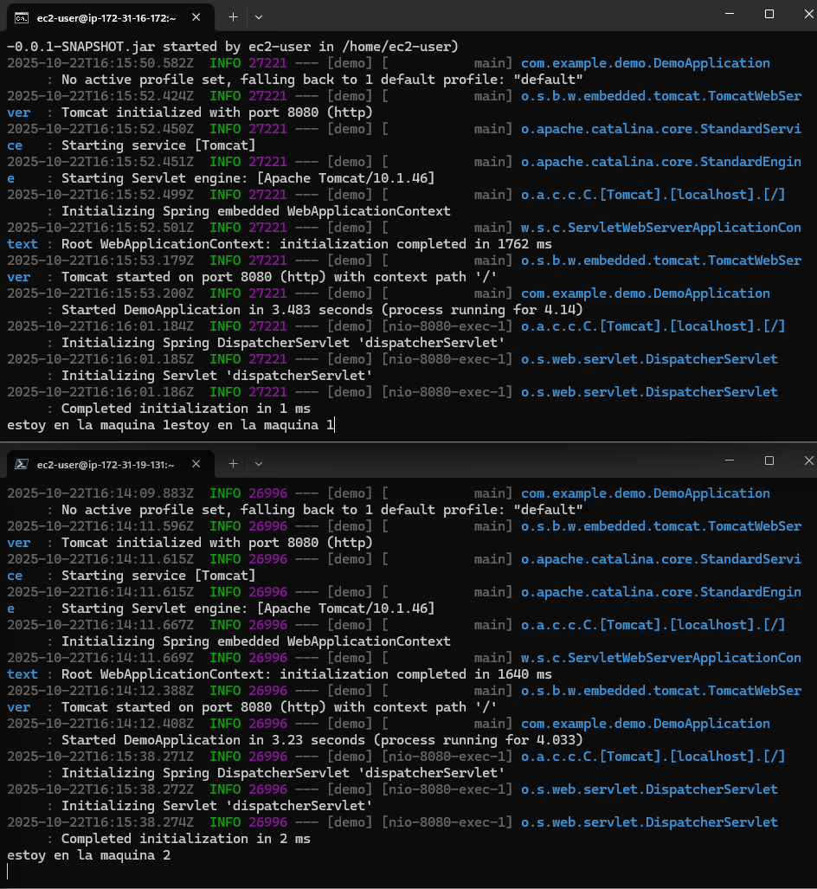
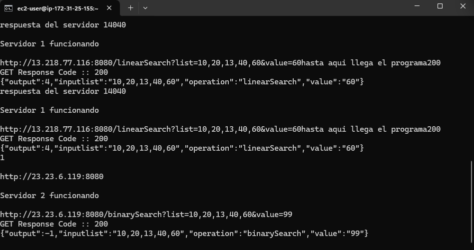
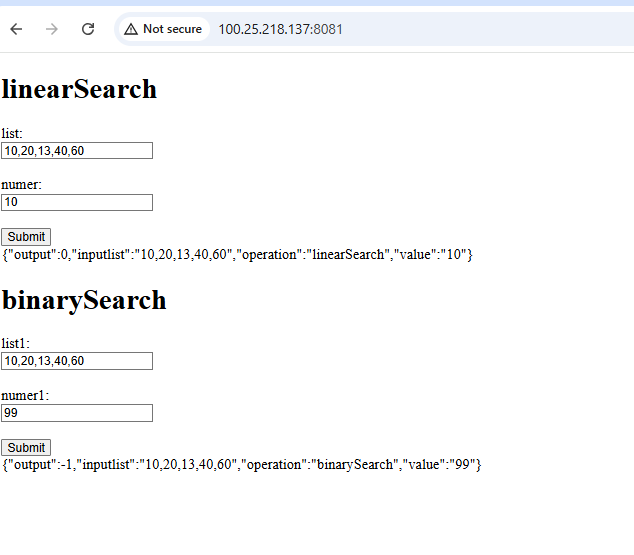

# parcial arep 2 

## Andres Serrato Camero 

se tienen dos aplicaciones 

los backends y el proxy 


### video ejecutando el programa 
https://youtu.be/CIGsS8L-N1Y

para ejecutarlos simplemente se debe clonar el repositorio 

```bash
https://github.com/andresserrato2004/Parcial-arep2.git
```
y elegir el proyecto que se debe correr recomiendo primero ejecutar el back y despues el proxy es de cir hacer

``` bash 
cd Parcial-arep2
cd demo

# abrir una consola o el editor de texto y en el cmd ejecutar  

mvn package spring-boot:run
# o si se quiere ejecutar el jar 
mvn package
java -jar /target/demo-0.0.1-SNAPSHOT.jar
```


la primer aplicacion son los backends que se desplegaron cada uno en un ec2 distinto 




depues se desplego el proxy que corre en otra maquina 




